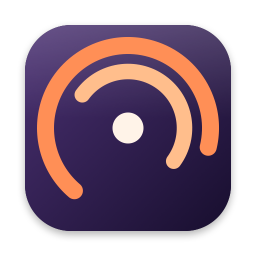
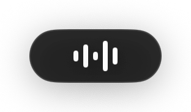
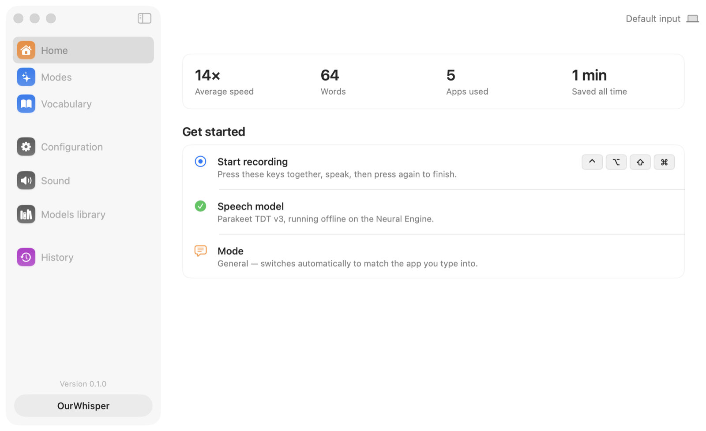
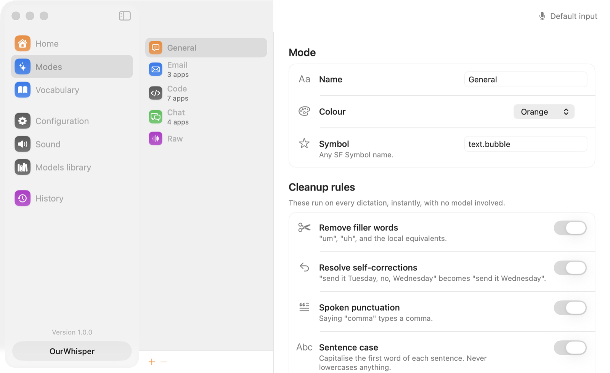
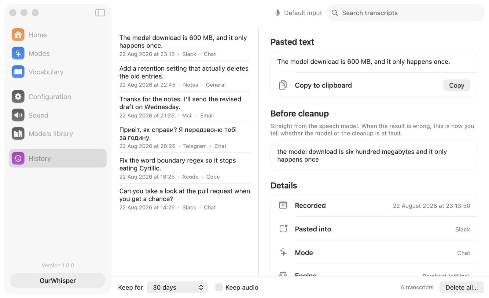

<p align="center">
  
</p>

<h1 align="center">OurWhisper</h1>

<p align="center">
  Local dictation for macOS. Hold a hotkey, talk, and the text lands in whatever field has focus.
</p>

<p align="center">
  <a href="#install-it-now"><b>Install</b></a> ·
  <a href="https://github.com/grozoww/my-whisper/releases">Releases</a> ·
  <a href="CONTRIBUTING.md">Build from source</a>
</p>

<p align="center">
  
</p>

Transcription runs on your Mac's Neural Engine. No audio leaves the machine unless you explicitly
turn on the optional cloud provider. There is no account, no telemetry, and no paid tier.

> Status: feature-complete and building from source. Not yet released — see [Roadmap](#roadmap).

## Install it now

```bash
curl -fsSL https://raw.githubusercontent.com/grozoww/my-whisper/main/scripts/install.sh | bash
```

Requires macOS 15 or later on Apple Silicon. What that script does, and how to install by hand
instead, is under [Install](#install).

<picture>
  <source media="(prefers-color-scheme: dark)" srcset="docs/images/home-dark.png">
  
</picture>

## Why another one

Superwhisper and Wispr Flow are good and closed. This is the same idea, open, with the model
choice made on evidence rather than brand recognition.

The default engine is **NVIDIA Parakeet TDT v3**, not Whisper. On FLEURS it is both faster and
more accurate than Whisper large-v3 for the languages this was built for:

| FLEURS WER (lower is better) | Parakeet v3 | Whisper large-v3 |
| ---------------------------- | ----------- | ---------------- |
| Ukrainian                    | **5.10%**   | 12.52%           |
| Russian                      | **3.00%**   | 4.04%            |
| Spanish                      | **3.45%**   | ~4.2%            |
| German                       | **5.04%**   | ~5.5%            |
| English                      | 4.85%       | ~4.2%            |

Parakeet is also roughly 11x faster on the Neural Engine and a third of the size. The trade-off
is language coverage: 25 European languages, so no Chinese or Japanese offline. Those route to
the optional cloud provider instead.

## Features

- **Global hotkey** — toggle, or push-to-talk. Text is pasted into the focused field of any app.
  Hold-to-talk waits a second by default, so a tap of fn still switches your keyboard language.
- **Fully offline by default** — Parakeet for speech, on-device cleanup. Zero API keys, zero
  accounts, and nothing to download beyond the speech model.
- **Modes** — per-profile prompts that clean up the raw transcript: drop `mm` and `hmm`, resolve
  self-corrections ("send it Tuesday, no, Wednesday" becomes "send it Wednesday"), set the tone.
  Modes can auto-switch based on the app you are typing into.
- **Menu bar app** with a floating pill overlay and live audio bars while recording.
- **Clipboard as context** — off by default, per mode. When it is on, whatever you have copied is
  shown to the on-device model as reference for spelling names and terms. It is never pasted, and
  a password copied from a password manager is skipped.
- **Clipboard in the paste** — also off by default, per mode, and the opposite treatment: what you
  copied is pasted exactly as you copied it. Copy a stack trace, say what you want done about it,
  and both land in one paste. Say the placeholder — "clipboard content" — and it lands *there*
  rather than at the end: *"here is the error I keep getting, clipboard content, what does it
  mean?"*. The model never sees it, so nothing rewrites it.
- **Vocabulary** — teach it your names, jargon, and spellings. Applied as an exact rule, not a
  hint to a model, so it works every time.
- **History** — searchable, stored locally, with a retention setting that actually deletes. Keeps
  the raw transcript next to the cleaned one, so a bad result can be traced to the stage that
  caused it.

## What it looks like

**Modes** — a mode is a named way of cleaning up what you said. Five are built in. The cleanup
rules run on every dictation with no model involved; the model instructions further down the
screen are what the on-device model is told when it is switched on.

<picture>
  <source media="(prefers-color-scheme: dark)" srcset="docs/images/modes-dark.png">
  
</picture>

**History** — every dictation, searchable, on your disk. The raw transcript is kept next to the
cleaned one, so when the wrong thing gets typed you can see which stage did it.

<picture>
  <source media="(prefers-color-scheme: dark)" srcset="docs/images/history-dark.png">
  
</picture>

The screenshots are made by `./scripts/screenshots.sh`, which runs the real app against invented
demo data.

## Languages

Offline (Parakeet TDT v3): 25 European languages, including English, Russian, Ukrainian, Spanish,
German, French, Polish, Italian, Portuguese, Dutch, Czech, Greek, Swedish and more.

Online (optional, Soniox): 60+ including Chinese and Japanese. Requires your own API key.

## Requirements

- macOS 15 (Sequoia) or later, Apple Silicon
- ~600 MB disk for the speech model, downloaded once on first launch
- Optional: macOS 26 with Apple Intelligence enabled, for model-based cleanup. Nothing to
  download, and the rule-based cleanup works without it on every supported version.

## Install

```bash
curl -fsSL https://raw.githubusercontent.com/grozoww/my-whisper/main/scripts/install.sh | bash
```

That fetches the newest build, copies OurWhisper to Applications and clears the download
quarantine flag. The last step is not a convenience. These builds are **not notarized** — Apple
charges $99 a year to vouch for a build, and this project does not pay it — and macOS refuses to
open an unnotarized download at all, with a dialog claiming the app is damaged. It is not damaged;
it is just not stamped. [`scripts/install.sh`](scripts/install.sh) is short and does nothing else,
so read it before you run it.

Prefer to do it by hand: download the DMG from
[Releases](https://github.com/grozoww/my-whisper/releases), drag OurWhisper to Applications, then
**right-click it and choose Open**, once. Every release says whether it is notarized. Every push to
`main` adds a prerelease, so there is always a current build to download and older ones stay where
they were; tags produce versioned releases.

OurWhisper then asks for Microphone and Accessibility permission, and both are required: the
microphone to hear you, Accessibility to watch for the hotkey and paste into the focused field.
It is a menu bar app — look for the microphone icon in the menu bar, not the Dock. There is a
"Show in the Dock" switch in Configuration if you would rather have one, and an "Open at login"
switch next to it.

You grant Accessibility once and it stays granted. macOS attaches that permission to the app's
code signature, so releases are signed with a certificate that does not change between versions.
Upgrading from a release older than that change costs you the grant one last time: the entry in
System Settings still shows a ticked OurWhisper and no longer applies to the new build. The Home
screen has a **Reset and ask again** button for exactly that, and by hand it is removing
OurWhisper from the list with the **−** button and adding it back.

Building from source is documented in [CONTRIBUTING.md](CONTRIBUTING.md).

## Privacy

- Audio and transcripts stay on disk, under your control, with a retention setting.
- No telemetry. No crash reporting. No network calls unless you enable a cloud provider.
- API keys you paste are stored in the **macOS Keychain**, never in a config file or a log, and
  are only ever sent to that provider.
- The clipboard is only read to paste, unless a mode has "Use the clipboard as context" or "Paste
  the clipboard after the text" switched on. Then it is read at the moment you start speaking,
  used for that one dictation, and dropped — it is never written to history and never sent
  anywhere. A password copied from a password manager is skipped either way.

## How cleanup works

Two stages, in this order, and the second is optional.

**Rules** run first: filler removal, self-corrections, spoken punctuation, sentence casing, and
your vocabulary list. They are pure functions — instant, deterministic, and identical every time.
They run on every dictation regardless of what else is available.

**The on-device model** runs second, if you turn it on. It handles what rules cannot: tone,
phrasing, and judgement about what you meant. Per mode, it can also be shown your clipboard as
reference — useful for replying to a message whose names you would otherwise have to spell out. If it is unavailable, slow, or returns something
implausible, the rule-cleaned text is used instead. A model problem costs you latency, never words.

## Roadmap

- [x] **P0** Project skeleton, permissions, menu bar, window shell
- [x] **P1** Core loop: record, transcribe with Parakeet, paste. Hotkey and pill overlay
- [x] **P2** Soniox cloud provider, model library and downloads
- [x] **P3** Modes, on-device cleanup, vocabulary
- [x] **P4** History, sound settings, themes, update check
- [ ] **P5** First signed and notarized release

## Credits

- [NVIDIA Parakeet TDT 0.6B v3](https://huggingface.co/nvidia/parakeet-tdt-0.6b-v3) — CC-BY-4.0
- [FluidAudio](https://github.com/FluidInference/FluidAudio) — CoreML runtime for Parakeet
- Apple's [Foundation Models](https://developer.apple.com/documentation/foundationmodels) — the
  on-device language model used for cleanup on macOS 26

## License

MIT. See [LICENSE](LICENSE). Models carry their own licenses, listed in the app's About screen.
